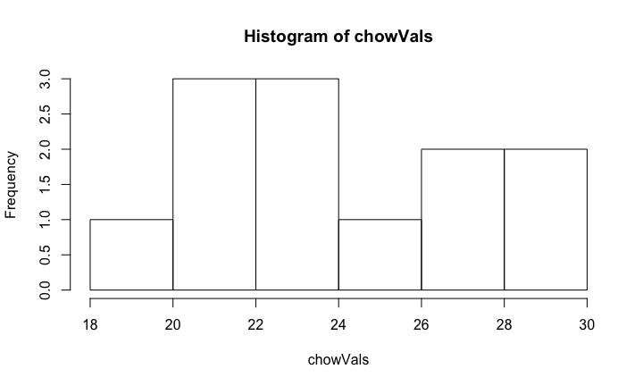
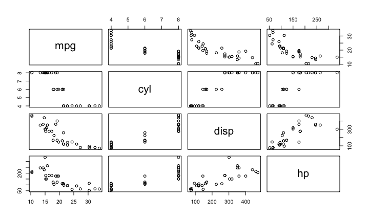

# The Hou*R* of Code
Sean Davis, MD/PhD  
`r format(Sys.Date(),"%A, %B %d, %Y")`  

# Introduction

## What is R?

- A software package
- A programming language
- A toolkit for developing statistical and analytical tools
- An extensive library of statistical and mathematical software and algorithms
- A scripting language
- ...

## Why R?

- R is cross-platform and runs on Windows, Mac, and Linux (as well as more obscure systems).
- R provides a vast number of useful statistical tools, many of which have been painstakingly tested.
- R produces publication-quality graphics in a variety of formats.
- R plays well with FORTRAN, C, and scripts in many languages.
- R scales, making it useful for small and large projects.  It is NOT Excel.
- R eschews the GUI.

> I can develop code for analysis on my Mac laptop.  I can then install the *same* code on our massive computer cluster and run it in parallel on 1000 samples, monitor the process, and then update a database with R when complete.

## Why not R?

- R cannot do everything.
- R is not always the ``best'' tool for the job.
- R will \textit{not hold your hand.
- The documentation can be opaque.
- R can drive you crazy (on a good day) or age you prematurely (on a bad one).
- Finding the right package to do the job you want to do can be challenging; worse, some contributed packages are unreliable.
- R eschews the GUI.

## R License and the Open Source Ideal

- R is free!
- Distributed under GNU license
    - You may download the source code.
    - You may modify the source code to your heart's content.
    - You may distribute the modified source code and even charge money for it, 
    - *but* you must distribute the modified source code under the original GNU license

### Take-home Message

This license means that R will always be available, will always be open source, and can grow organically without constraint.

# Getting started

## Installation

The first step is to install R. You can download and install R from
the [Comprehensive R Archive Network](https://cran.r-project.org/)
(CRAN). It is relatively straightforward, but if you need further help
you can try the following resources: 

* [Installing R on Windows](https://github.com/genomicsclass/windows#installing-r) 
* [Installing R on Mac](http://youtu.be/Icawuhf0Yqo)
* [Installing R on Ubuntu](http://cran.r-project.org/bin/linux/ubuntu/README)

## Installing RStudio

The next step is to install [RStudio](https://www.rstudio.com), a program for viewing and running
R scripts. Technically you can run all the code shown here without
installing RStudio, but we highly recommend this integrated
development environment (IDE). 

- [Instructions are here](http://www.rstudio.com/products/rstudio/download/). 

## R on your own

Try out the [swirl](http://swirlstats.com/) tutorial, which teaches you R programming and data science interactively, at your own pace and in the R console. Once you have R installed, you can install `swirl` and run it the following way: 


```r
install.packages("swirl")
library(swirl)
swirl()
```

## Quick R references

There are also many open and free resources and reference
guides for R. Two examples are:

- [Quick-R](http://www.statmethods.net/): a quick online reference for data input, basic statistics and plots
- R reference card [PDF](https://cran.r-project.org/doc/contrib/Short-refcard.pdf) by Tom Short

# R from zero

## Follow along

- In RStudio, copy and paste the following:


```r
download.file('https://raw.githubusercontent.com/seandavi/hour_of_code/master/HourOfCode.Rmd',
              destfile='HourOfCode.Rmd')
```

- In the file pane, you can choose the `HourOfCode.Rmd` file and it will open in the RStudio text pane. 


## Interacting with R

### Expression


```r
1 + pi + sin(3.7)
```

```
## [1] 3.611757
```

### Assignment


```r
x = 1
y <- 2
3 -> z
```

## Interacting with R

- The `<-`, `->` and `=` are all assignment operators.


```r
x = 1
y <- 2
3 -> z
```

- If a line is not a complete R command, R will continue the next line with a `+`.


```r
1 + pi + 
    sin(3.7)
```

## Getting help

R has extensive help functionality built in.


```r
help('print')
help(print)
?print
?data.frame
?`+`
```


```r
help.search('microarray')
RSiteSearch('microarray')
```

- *For any new function that you see, type `help(newfunction)`*.

# First steps in R

## Paths and the Working Directory

When you are working in R it is useful to know your _working directory_. This is the directory or folder in which R will save or look for files by default. You can see your working directory by typing:


```r
getwd()
```

## Loading data into R

R can read files of many different types and from many different sources. 

### Directly from the web


```r
dir <- "https://raw.githubusercontent.com/genomicsclass/dagdata/master/inst/extdata/"
url <- paste0(dir, "femaleMiceWeights.csv")
dat <- read.csv(url)
```

### Download first


```r
library(downloader) ##use install.packages to install
dir <- "https://raw.githubusercontent.com/genomicsclass/dagdata/master/inst/extdata/"
filename <- "femaleMiceWeights.csv" 
url <- paste0(dir, filename)
if (!file.exists(filename)) download(url, destfile=filename)
```

## Working with data


```r
head(dat)
tail(dat)
summary(dat)
dim(dat)
```

## Working with data


```r
head(dat)
```

```
##   Diet Bodyweight
## 1 chow      21.51
## 2 chow      28.14
## 3 chow      24.04
## 4 chow      23.45
## 5 chow      23.68
## 6 chow      19.79
```

## Working with data


```r
tail(dat)
```

```
##    Diet Bodyweight
## 19   hf      29.58
## 20   hf      30.92
## 21   hf      34.02
## 22   hf      21.90
## 23   hf      31.53
## 24   hf      20.73
```

## Working with data


```r
summary(dat)
```

```
##    Diet      Bodyweight   
##  chow:12   Min.   :19.79  
##  hf  :12   1st Qu.:22.36  
##            Median :25.16  
##            Mean   :25.32  
##            3rd Qu.:28.14  
##            Max.   :34.02
```

## Working with data


```r
dim(dat)
```

```
## [1] 24  2
```

# dplyr

## dplyr filter


```r
library(dplyr) 
chow <- filter(dat, Diet=="chow") #keep only the ones with chow diet
head(chow)
```

```
##   Diet Bodyweight
## 1 chow      21.51
## 2 chow      28.14
## 3 chow      24.04
## 4 chow      23.45
## 5 chow      23.68
## 6 chow      19.79
```

## dplyr select


```r
chowVals <- select(chow,Bodyweight)
head(chowVals)
```

```
##   Bodyweight
## 1      21.51
## 2      28.14
## 3      24.04
## 4      23.45
## 5      23.68
## 6      19.79
```

## Piping


```r
chowVals <- filter(dat, Diet=="chow") %>% select(Bodyweight) %>% unlist
hist(chowVals)
```

<!-- -->

# Plotting with ggplot2

## ggplot2 package

The `ggplot2` package is a relatively novel approach to generating highly informative publication-quality graphics. The "gg" stands for "Grammar of Graphics". In short, instead of thinking about a single function that produces a plot, `ggplot2` uses a "grammar" approach, akin to building more and more complex sentences to layer on more information or nuance. 

## Data Model

The `ggplot2` package assumes that data are in the form of a data.frame. In some cases, the data will need to be manipulated into a form that matches assumptions that `ggplot2` uses.  In particular, if one has a *matrix* of numbers associated with different subjects (samples, people, etc.), the data will usually need to be transformed into a "long" data frame. 

## Getting started

To use the `ggplot2` package, it must be installed and loaded. Assuming that installation has been done already, we can load the package directly:


```r
library(ggplot2)
```

## Playing with ggplot2

## mtcars data

We are going to use the mtcars dataset, included with R, to experiment with `ggplot2`. 


```r
data(mtcars)
```

- Exercise: Explore the `mtcars` dataset using `View`, `summary`, `dim`, `class`, etc.

## Pairs plot

We can also take a quick look at the relationships between the variables using the `pairs` plotting function.


```r
pairs(mtcars[,1:4])
```

<!-- -->

## Go to the vignette


```r
download.file('https://raw.githubusercontent.com/seandavi/hour_of_code/master/ggplot2.Rmd',
              destfile='ggplot2.Rmd')
```

# sessionInfo

## sessionInfo


```r
sessionInfo()
```

```
## R Under development (unstable) (2016-10-26 r71594)
## Platform: x86_64-apple-darwin13.4.0 (64-bit)
## Running under: macOS Sierra 10.12.1
## 
## locale:
## [1] en_US.UTF-8/en_US.UTF-8/en_US.UTF-8/C/en_US.UTF-8/en_US.UTF-8
## 
## attached base packages:
## [1] stats     graphics  grDevices utils     datasets  base     
## 
## other attached packages:
## [1] ggplot2_2.2.0 dplyr_0.5.0   knitr_1.15.1 
## 
## loaded via a namespace (and not attached):
##  [1] Rcpp_0.12.8.2      digest_0.6.10      rprojroot_1.1     
##  [4] assertthat_0.1     plyr_1.8.4         grid_3.4.0        
##  [7] R6_2.2.0           gtable_0.2.0       DBI_0.5-1         
## [10] backports_1.0.4    magrittr_1.5       scales_0.4.1      
## [13] evaluate_0.10      stringi_1.1.2      lazyeval_0.2.0    
## [16] rmarkdown_1.2.9000 tools_3.4.0        stringr_1.1.0     
## [19] munsell_0.4.3      yaml_2.1.14        colorspace_1.3-1  
## [22] htmltools_0.3.5    methods_3.4.0      tibble_1.2
```
